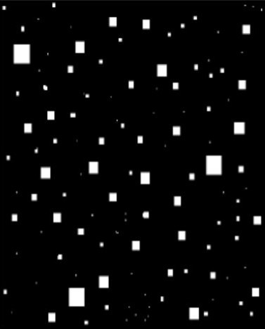
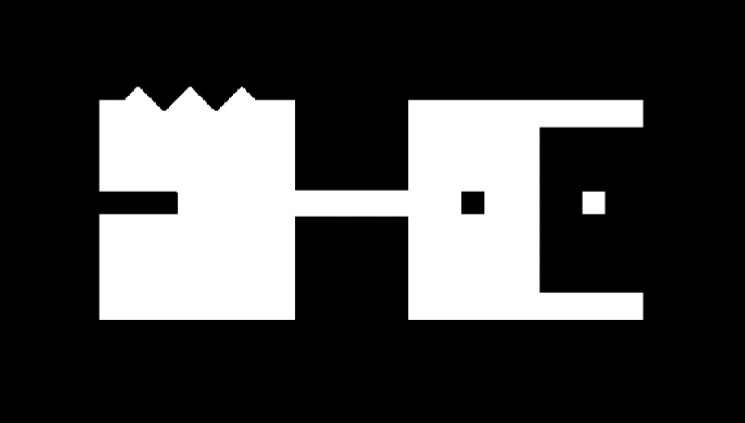
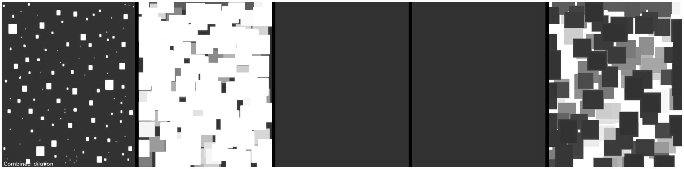
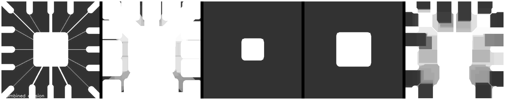
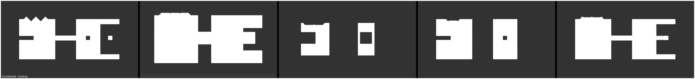

# Morphological Image Processing

This project demonstrates the implementation and analysis of morphological operations such as dilation, erosion, opening, and closing on various images.

## Objective

- To learn the operations of dilation and erosion.
- To learn the operations of opening and closing.
- To understand the characteristics of related algorithms.

## Requirements

1. Implement the related morphology algorithms and analyze the characteristics based on the given five images.
2. Finish the experimental report.

## Principles of the Related Algorithm

- **Dilation:** Enlarges the boundaries of objects in an image.
- **Erosion:** Shrinks the boundaries of objects in an image.
- **Opening:** Removes small objects from the foreground, typically noise.
- **Closing:** Fills small holes in the foreground and connects disjoint objects.

## Functions Overview

### MorphologicalOperations Class

- **__init__(kernel_size=(15, 15)):** Initializes with a kernel size.
- **dilate(image, iterations=3):** Applies dilation to an image.
- **erode(image, iterations=3):** Applies erosion to an image.
- **open(image, iterations=3):** Applies opening (erosion followed by dilation).
- **close(image, iterations=3):** Applies closing (dilation followed by erosion).

### ImageProcessor Class

- **__init__(filepaths):** Initializes with a list of image file paths.
- **apply_operations():** Applies dilation, erosion, opening, and closing to the images.
- **adjust_contrast_and_brightness(image, contrast=1.5, brightness=50):** Adjusts contrast and brightness.
- **overlay_difference(original, processed):** Overlays the difference between the original and processed images.
- **add_border_and_label(image, label, color=(255, 0, 0)):** Adds a border and label to the image.
- **display_combined_images(title, original_images, processed_images, operation):** Displays combined images with labels.
- **show_results():** Shows the results of the morphological operations.
- **save_images(output_dir):** Saves the processed images to a specified directory.
- **save_combined_images(output_dir):** Saves combined images (original and processed) to a specified directory.

## Original Images

Here are the original images used for the experiment:

  
  

  
  

## Results

### Dilation Results

### Erosion Results

### Opening Results

### Closing Results

## Conclusion

This project successfully implemented and analyzed the morphological operations of dilation, erosion, opening, and closing. By applying these operations to various images, their distinct effects were observed and visualized, providing a comprehensive understanding of their characteristics and practical applications in image processing.

## Repository

[GitHub Repository](https://github.com/Hetawk/morphological_image_processing.git)
